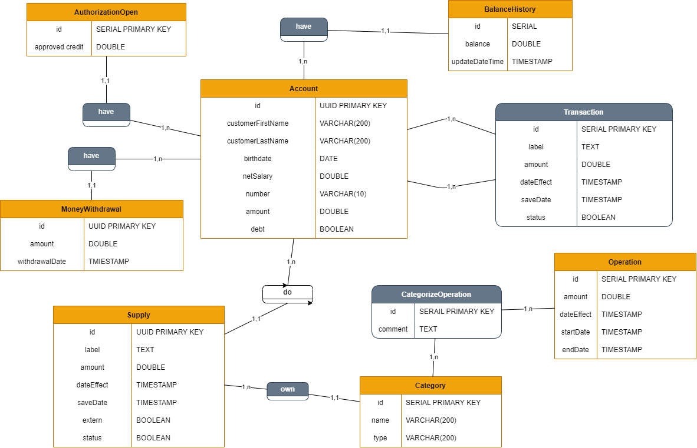

# NumBank API

### Specification
To view specification api in Swagger UI : [click here](https://petstore.swagger.io/?url=https://raw.githubusercontent.com/NumBank/NumBank-API/main/docs/api.yml)

### Get started
- Clone this repository
- Open in code editor (IntelliJ or VSCode)
- Create database in your postgres
- Execute sql file on ``ressouces/db/migration``(most important):
    -   V1__init_database.sql
    -   V2__initial_categories.sql
- Add environment variable
    ```YML
    DB_URL: "POSTGRES_DATABASE"
    DB_USERNAME: "POSTGRES_USER"
    DB_PASSWROD: "POSTGRES_PASSWORD"
    ```

#### Demo test version of api : [drive](https://drive.google.com/drive/folders/1-uhyisGwIjkb1R6o5icmzJgeZLrzMPrj?lfhs=2) [video & collection file(json)]

### MCD

